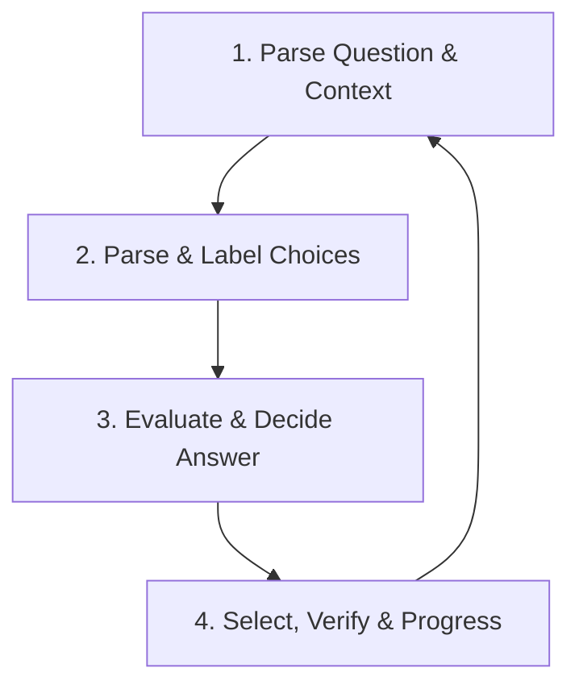

# Form-Filling and Multiple-Choice Question (MCQ) Automation Protocol

This protocol guides **Spark** (the reasoning agent) and **Antigravity** (the browser driver) in executing high-speed, high-accuracy form-filling and multiple-choice question (MCQ) Answering. 

By applying this structured loop, the agents can systematically read questions, evaluate answers, select choices, verify actions, and cache spatial UI layouts for rapid execution on recurring pages.

---

## 1. The Core MCQ Execution Loop

For every question encountered, the agents must proceed through a strict four-step loop:



### Step 1: Parse the Question & Context
*   **Action:** Locate and extract the question text from the DOM.
*   **Edge Cases to Check:**
    *   **Negations:** Look for words like `NOT`, `EXCEPT`, `FALSE`, or `INCORRECT` in the question body.
    *   **Contextual Material:** Check for accompanying code snippets, tables, or image tags (``) that contain critical data.
    *   **Weight:** Note if the question is multi-select (checkboxes) rather than single-choice (radio buttons).

### Step 2: Parse and Map the Answer Choices
*   **Action:** Find all interactive choice elements and map them to their corresponding text labels.
*   **Implementation Rule:**
    *   Group the elements logically (e.g., a `<ul>` of choices, or elements sharing a common `name` attribute).
    *   Construct a map inside working memory:
        ```json
        {
          "A": {"selector": "input#choice_0", "text": "Option A text"},
          "B": {"selector": "input#choice_1", "text": "Option B text"}
        }
        ```

### Step 3: Evaluate & Decide the Answer
*   **Action:** Compare the question context against the mapped choices.
*   **Reasoning Process:**
    *   *Self-Containment:* If the answer is directly derivable from the prompt, decide immediately.
    *   *External Lookup:* If external knowledge is required, formulate a concise search query and fetch the answer (using Google or Perplexity).
    *   Assign a confidence level (High / Medium / Low) to the choice.

### Step 4: Select, Verify & Progress
*   **Action:** Interact with the browser to click the chosen element, verify the click, and move to the next item.
*   **Verified Use Rule:**
    *   Never assume a click succeeded. After clicking an option, run a page evaluation to verify the element is in a checked/active state:
        ```javascript
        // Example verification check
        document.querySelector('input#choice_0').checked === true
        ```
    *   If verification fails, retry the click or fall back to keyboard navigation (`Press Key: Tab / Space`).
*   **Navigation Decision:**
    *   For single-page quizzes: Proceed to the next question block.
    *   For multi-page quizzes: Click the "Next" button.

---

## 2. Spatial Memory and Speed Optimization

To maximize speed, the browser agent must "learn" the interface layout after the first question and cache the location of UI elements.

### How to Build Spatial Memory:
1.  **First Question (Discovery Phase):**
    *   Perform a deep DOM query to locate the Question container, the Answer choices container, and the "Next Question" or "Submit" buttons.
    *   Save these selectors/coordinates into the active working memory (`STATE.md`) under a temporary `## Spatial Memory` header.
2.  **Second Question onwards (Acceleration Phase):**
    *   Skip the discovery phase. Directly access the cached selectors.
    *   Interact using targeted coordinates or specific ID elements.
3.  **Layout Shifts (Verification):**
    *   If a cached selector fails to return an element or the page URL shifts structure, immediately invalidate the spatial memory and re-run the discovery phase.

---

## 3. Working Memory Integration (`STATE.md`)

To survive agent restarts or connection drops, the agent must write its progress and spatial cache to the repository's `STATE.md`.

### Example `STATE.md` Schema for MCQ Progress:

```markdown
## MCQ Automation Progress
- **Target Assessment:** Canvas Unit 4 Quiz (URL: https://canvas.jccc.edu/courses/87710/quizzes/12345)
- **Status:** In Progress (Question 7 of 20)
- **Last Verified Answer:** Question 6 - Selected "C" (Verified: True)

## Spatial Memory (Cached Selectors)
- **Question Body:** `div.question_text`
- **Choice Inputs:** `input[type="radio"][name="question_7"]`
- **Next Button:** `button#submit_quiz_button`

## Flagged Questions (Requires User Review)
- [ ] **Question 3:** Ambiguous wording on question ("Which is NOT..."). Selected "B" with 60% confidence. Needs manual review at completion.
```

---

## 4. Automation Snippet (Playwright)

Here is a reference snippet for `browser_core_v2.py` to handle standard multiple-choice forms programmatically:

```python
def solve_mcq_question(page, question_selector, choices_selector, next_button_selector):
    """
    Automated MCQ solver implementing the verified loop
    """
    # 1. Parse Question
    question_text = page.locator(question_selector).first.inner_text()
    print(f"[MCQ] Question: {question_text[:80]}...")

    # 2. Map Choices
    choices = page.locator(choices_selector).all()
    choices_map = {}
    for i, choice in enumerate(choices):
        text = choice.inner_text()
        choices_map[chr(65 + i)] = {"element": choice, "text": text}
        print(f"  [{chr(65 + i)}] {text}")

    # 3. Decide (Agent Reasoning Placeholder)
    # The agent will evaluate which key (A, B, C, D) is correct.
    decided_key = "A"  # Let's assume reasoning chose 'A'
    selected_choice = choices_map[decided_key]["element"]

    # 4. Select & Verify (Different Method Verification)
    selected_choice.click()
    
    # Read state back via JS evaluation
    is_checked = page.evaluate(f"""() => {{
        const el = document.querySelector('{choices_selector}');
        return el ? el.checked || el.getAttribute('aria-checked') === 'true' : false;
    }}""")
    
    if not is_checked:
        print("[!] Warning: Selection state could not be verified in the DOM.")
    
    # 5. Progress
    page.locator(next_button_selector).click()
```
