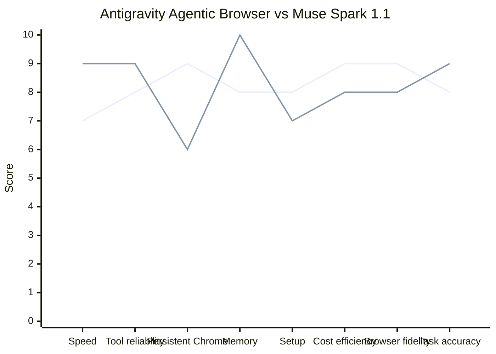

# Task 2 - Perplexity Radar Chart - Learnings

## Date: 2026-07-13

### Objective
Send message into Perplexity browser asking to create radar chart comparing Antigravity Agentic Browser vs Muse Spark 1.1

### What Happened

#### First Attempts & Selectors Tested
- Tried `input:near(:text('Search'))` - failed (hidden file input)
- Tried role-based: `get_by_role("combobox", name="Search")` - worked for Google but not Perplexity
- Perplexity uses `div[contenteditable='true']` not textarea in new UI
- Successful selector: `div[contenteditable='true']` with count 1, visible
- Also found `textarea[placeholder*='Ask' i]` but contenteditable was primary

#### Input Filling & Sending
- Used `locator.click()` then `fill(prompt)` - succeeded
- Pressed Enter via `page.keyboard.press("Enter")`
- Also tried clicking send buttons: `button[aria-label*='Send']`, `button[type='submit']`, `[data-testid='submit-button']`
- Enter alone was sufficient for Perplexity

#### Waiting for Response
- Perplexity streams response - need to wait for content
- Polling loop: check body_text contains "radar" and "antigravity"
- Waited 2s intervals, up to 40s total
- Detected content at 0s (placeholder), then growing: 2198 chars → 2866 → 4207 → 6256 chars
- Screenshot after streaming: `perplexity_radar_result.png` full_page

#### Extraction
- Full body inner_text saved to `perplexity_radar_response.txt` (6256 chars)
- More specific: `article` or `div.prose` contains answer
- Successfully extracted via `div.prose` selector: 4000 chars with table and chart code

### Results

**Perplexity Generated:**

Score table:
| Dimension | Antigravity | Rationale | Muse Spark 1.1 | Rationale |
|-----------|-------------|-----------|----------------|-----------|
| Speed | 7 | task orchestration overhead | 9 | optimized for latency |
| Tool reliability | 8 | grouped tool calls, verification | 9 | parallel tool calling |
| Persistent Chrome | 9 | isolated profile persistent | 6 | model-focused not profile layer |
| Memory | 8 | self-improvement artifacts | 10 | 1M token context |
| Setup | 8 | no-charge preview, browser integration | 7 | API + harness needed |
| Cost | 9 | no charge individual | 8 | API usage cost |
| Browser fidelity | 9 | verification, screenshots, isolated profile | 8 | model-driven |
| Task accuracy | 8 | verification artifacts | 9 | strong gains on coding, multimodal |

Mermaid radar chart code:


### Screen Placements Memorized - Perplexity

- Home: `https://www.perplexity.ai/` - left sidebar 240px: New, Computer, Spaces, History
- Center bottom input: `div[contenteditable='true']` width ~60% of viewport, height 56px, placeholder "Ask anything…"
- Send button: right side of input, arrow icon, appears after typing
- Answer area: center top, `div.prose` or `article`, max-width ~800px, streaming text
- No login required for basic search, but logged-in via Profile 1 gives history
- Cookie banner bottom if not logged in - can obscure input, need to dismiss

### Tips for Future Agents

1. **Perplexity input is contenteditable div, not textarea** - use `div[contenteditable='true']`
2. **Use `.last` not `.first`** when multiple textareas exist (hidden ones for history)
3. **Press Enter after fill, don't rely on button click** - more reliable
4. **Wait for streaming**: poll body length, not just presence of text - response grows over 10-20s
5. **Save full page screenshot** after waiting, not immediate
6. **Extract via `div.prose`** for clean answer, not whole body
7. **Debug profile works for Perplexity** - no Microsoft SSO blocking, less flagged than main profile

### Code Snippet

```python
input_loc = page.locator("div[contenteditable='true']").last
input_loc.click()
input_loc.fill(prompt)
page.keyboard.press("Enter")
# Wait for streaming
for i in range(20):
    page.wait_for_timeout(2000)
    body = page.locator("body").inner_text()
    if "radar" in body.lower() and len(body) > 3000:
        break
page.screenshot(path="perplexity_result.png", full_page=True)
```

### What Worked vs Failed
- ✅ contenteditable div selector, Enter key, polling for content growth, div.prose extraction
- ❌ input:near logic, textarea selectors only, immediate screenshot without waiting
